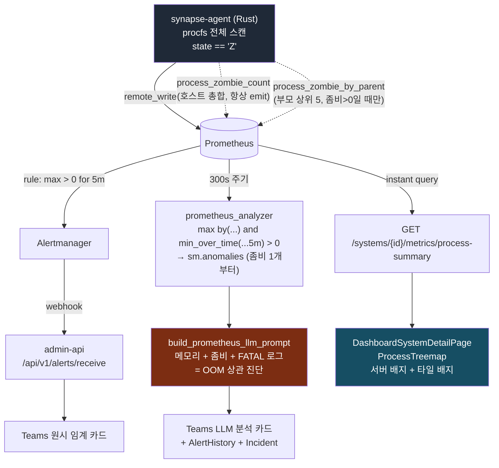

# 좀비 프로세스 이상 감지 · 알림 · 표출 설계

> 작성일: 2026-08-27 · 대상: synapse-agent(Rust) / Prometheus / admin-api / frontend
> 상태: **설계(spec)** — 구현은 `/sc:implement` 또는 별도 지시로 진행

---

## 0. 배경 및 요구사항

WAS(JVM)에서 `OutOfMemoryError`가 발생하면 자식 프로세스가 비정상 종료되고, 부모가
`wait()`를 호출하지 못해 **defunct(state=Z) 프로세스가 누적**되는 패턴이 반복적으로 관측된다.
좀비는 PID 슬롯만 점유하므로 CPU·메모리 지표에는 잡히지 않아, 현재 대시보드로는 인지가 불가능하다.

요구사항 3가지:

| # | 요구 | 대상 레이어 |
|---|---|---|
| R1 | 좀비 **임계치 이상 감지** + prometheus_analyzer 이상 항목으로 승격 | admin-api |
| R2 | Prometheus **5분 주기 알림** 추가 | alert_rules.yml |
| R3 | 시스템 상세 모니터링 화면 **프로세스 영역에서 좀비 인지** 가능하게 표출 | frontend + admin-api |

---

## 1. 현황 (As-Is)

| 레이어 | 파일 | 현재 상태 |
|---|---|---|
| Agent 수집 | `agent/src/metrics/process.rs:63,123` | `stat.state == 'Z'` 카운트 → `process_zombie_count` **매 주기 emit (0 포함)**. 라벨은 base 4종(`system_name`/`display_name`/`instance_role`/`host`)뿐 |
| Prometheus 룰 | `main-server/configs/alert_rules.yml` | **없음** (cpu / memory / log_error 3개 그룹만 존재) |
| 이상 감지 | `admin-api/services/prometheus_analyzer.py:545` | `process_zombie_count > 0` 조회 → `SystemMetrics.zombie_count` 저장. **`sm.anomalies`에 추가 안 함** |
| LLM 프롬프트 | `admin-api/services/prompts.py:294` | `⚠️ 좀비 프로세스 N개 감지` 라인 출력 |
| 프론트엔드 | `frontend/.../ProcessTreemap.tsx` | **표출 없음** |

### 현황의 핵심 결함 3가지

1. **좀비 단독으로는 아무 일도 일어나지 않는다.**
   `run_analysis_cycle()`은 `anomalous_hosts = {h for h, hc in hosts.items() if hc.has_anomaly}`
   (`prometheus_analyzer.py:678`)로 필터링하고, `has_anomaly`는 `any(sm.anomalies)`다.
   좀비가 500개여도 CPU/메모리/HTTP/디스크가 정상이면 LLM 분석도, Teams 알림도 발생하지 않는다.

2. **집계 누락 — 다중 에이전트 호스트에서 값이 덮어써진다.**
   `process_zombie_count`는 procfs 전체를 스캔하므로 **호스트 전역 값**이다.
   한 호스트에 계정별 WAS 에이전트가 2개 설치되면 두 시계열이 **같은 수치**를 보고한다.
   현재 쿼리는 이웃 항목들과 달리 `max by (...)` 집계 없이 raw 시계열을 순회하며
   `hosts[host].systems[sn].zombie_count = val`을 수행 → **마지막 시계열이 이김(last-wins)**.
   → `process_cpu_percent`가 이미 쓰는 `max by (...)` 패턴(`:517`)으로 정렬 필요.

3. **어느 프로세스가 좀비를 만드는지 알 수 없다.**
   호스트 총합 카운트만 있어 "OOM 난 WAS가 어느 것인가"를 특정할 수 없다.
   R3(화면 표출)을 의미 있게 만들려면 **부모 프로세스 귀속 정보**가 필요하다.

---

## 2. 설계 결정 (Decisions)

### D1. 기존 메트릭은 라벨을 늘리지 않고, 상세는 신규 메트릭으로 분리

`process_zombie_count`에 `parent_process` 라벨을 추가하면 `max by (host, system_name)` 집계 시
"부모별 값 중 최댓값"이 되어 **호스트 총합이 아니게 된다**. 모든 소비자(analyzer, alert rule)를
동시에 고쳐야 하고 과거 데이터와 의미가 달라진다.

**결정**: `process_zombie_count`는 **현재 라벨셋 그대로 유지**(호스트 총합).
부모 귀속은 신규 메트릭 `process_zombie_by_parent`로 분리한다.

### D2. 집계는 `max`, 절대 `sum` 아님

호스트 전역 값이므로 다중 에이전트 환경에서 `sum`은 2배 계상된다.
Analyzer 쿼리·alert rule 모두 `max by (...)`로 통일한다.

### D3. Prometheus 룰과 analyzer는 **둘 다** 둔다 (중복은 기존 설계와 동일)

이미 CPU가 같은 구조다 — `alert_rules.yml`의 `CPUHighUsage`(>85, critical)와
`prometheus_analyzer`의 `cpu > _CPU_THRESHOLD`(70, warning)가 공존하며,
전자는 **원시 임계 알림 카드**, 후자는 **LLM 교차분석 카드**로 성격이 다르다.
좀비도 동일 패턴을 따른다.

| 경로 | 역할 | 임계치 | 지연 | 산출물 |
|---|---|---|---|---|
| Prometheus rule | 결정적 증상 알림 | `> 0` (warning) / `>= 20` (critical) | `for: 5m` | Alertmanager → admin-api → Teams 원시 카드 |
| prometheus_analyzer | OOM 상관 진단 | `> 0` (env, warning) / `> 20` (critical) | 5분 지속 게이트 + 최대 300초 주기 | LLM 분석 카드 + AlertHistory + Incident |

⚠️ **알려진 제약**: alert rule의 임계치는 YAML 하드코딩이라 `PROM_ALERT_ZOMBIE_COUNT`
환경변수와 **자동 동기화되지 않는다**. CPU(85 vs 70)와 동일한 기존 제약이며, 문서로만 관리한다.
단 warning은 양쪽 모두 `> 0`이므로 실질적인 동기화 부담은 critical 값(20) 하나뿐이다.

⚠️ **Alertmanager inhibit 주의**: `alertmanager.yml`의 `inhibit_rules`는 `equal: ['instance']`인데
synapse 알림에는 `instance` 라벨이 없다 → 빈 값끼리 일치로 간주되어
**어디서든 critical이 하나 발생하면 전체 warning이 억제된다**. 기존 동작이며 본 설계에서 변경하지 않는다.

### D4. 감지 기준은 **개수가 아니라 지속 시간** — 좀비 1개부터 알림

**임계치를 20으로 두지 않는다. warning은 `> 0`이다.**

정상 동작하는 부모는 자식 종료 즉시 `wait()`로 회수하므로 좀비 수명은 밀리초 단위다.
따라서 **5분간 살아있는 좀비는 1개라도 "부모가 회수를 못 하고 있다"는 확정적 신호**이며,
이것이 요구사항의 OOM 시나리오 그 자체다. 개수 임계치 20은
"부모가 이미 20번 실패한 뒤"에야 알리는 셈이라 초기 징후를 놓친다.

오탐 방어선은 **개수가 아니라 지속 조건(`for: 5m`)이 담당**한다.
`alert_rules.yml` 하우스 스타일(`interval: 1m` + `for: 2m~5m`)에 맞춰
**`interval: 1m` + `for: 5m`** 을 쓴다.

상시 좀비를 달고 사는 레거시 앱은 전역 임계치를 올려 막지 않고,
D5의 `MetricType.ZOMBIE` + `metric_exclusions`로 **해당 시스템만 개별 예외/override** 처리한다.

> 요구사항 "prometheus 5분주기 알림"을 "5분 이상 지속 시 알림"으로 해석했다.
> "5분마다 재알림"이 의도라면 `alertmanager.yml`의 `repeat_interval: 1h` 조정이라는
> 별개 변경이 된다(전역 영향 → 권장하지 않음).

### D4-b. analyzer에도 **동일한 5분 지속 게이트**를 건다 (임계치 0의 필연적 귀결)

Prometheus 룰에는 `for: 5m`이 있지만 **`prometheus_analyzer`에는 대응물이 없다** —
300초마다 instant query를 한 번 쏘는 구조다.
임계치가 20일 때는 개수 자체가 오탐을 막아줬지만, `> 0`으로 낮추는 순간
**단 한 번의 샘플에 순간 좀비가 잡히면 곧바로 LLM 분석 + AlertHistory + Incident가 생성**된다.

→ analyzer 쿼리를 instant에서 **지속 게이트가 걸린 형태로 바꾼다**:

```promql
(max by (host, system_name, display_name) (process_zombie_count))
  and
(min_over_time(
   (max by (host, system_name, display_name) (process_zombie_count))[5m:1m]
 ) > 0)
```

- `and` 우변이 게이트: 최근 5분의 **매 지점에서 좀비가 1개 이상**이었을 때만 통과
- 좌변이 값: 알림에 표시되는 수치는 **최솟값이 아니라 현재값**
- 게이트가 성립하는 전제는 **에이전트가 좀비 0도 매 주기 emit** 한다는 것(§3.1.3). 0 샘플이
  윈도우에 들어와야 `min_over_time`이 0을 반환해 차단이 걸린다.

⚠️ **알려진 엣지 케이스 (실측 확인됨)**: 에이전트가 방금 기동해 **5분 윈도우에 이전 샘플이
전혀 없는 경우**, `min_over_time`은 존재하는 샘플(전부 nonzero)만 보므로 게이트가 즉시 통과한다.
Prometheus 룰의 `for: 5m`은 데이터 이력과 무관하게 항상 5분의 실제 경과 시간을 요구하므로,
**에이전트 재기동 직후에는 analyzer 경로가 룰 경로보다 최대 5분 먼저 발화**할 수 있다.

- 영향: 낮음. 이 상황의 좀비는 "방금 생긴 것"이 아니라 "이미 존재하던 것"이므로 발화 자체는
  올바르다. 게다가 `_is_in_cooldown()` 30분 호스트 쿨다운이 반복 발화를 막는다.
- 완화하려면 `count_over_time(...) >= 5` 절을 추가해 윈도우 충족을 강제할 수 있으나,
  절이 하나 더 늘어나는 비용 대비 이득이 없어 **채택하지 않는다**.

### D5. `MetricType.ZOMBIE` 신설 — 3곳 동시 수정 필요

`_excluded()` 호출에 metric type이 필요하다. 신설하지 않으면:
- 시스템별 **예외처리/임계치 override 불가** (다른 모든 메트릭은 지원)
- `matched_metric_types`가 비어 `/metric/similarity` 과거 해결책 조회가 스킵됨 (`:721`)

`metric_types.py` 상단에 `# SYNC:` 주석이 있으므로 **backend enum + frontend 상수**를 함께 수정한다.

### D6. OOM 상관관계는 PromQL 복합식이 아니라 **LLM 프롬프트 레이어**에서 처리

`좀비 AND 메모리높음` 형태의 복합 alert expr은 만들지 않는다. 이유:
- `LogFatalDetected` 룰이 이미 `level=~"FATAL|CRITICAL"`로 `OutOfMemoryError` 로그를 잡는다
- `build_prometheus_llm_prompt()`가 **한 호스트의 메모리 + 좀비 + 로그 에러를 하나의 프롬프트**에
  이미 담고 있다 — 상관 분석은 analyzer의 본래 역할이다
- 복합 expr은 임계치 두 개가 얽혀 오탐/미탐 튜닝이 불가능해진다

→ **좀비 룰은 단독 증상 룰**로 두고, 인과 해석은 LLM에 맡긴다.
다만 프롬프트에 OOM 힌트를 명시해 LLM이 올바른 가설을 세우도록 유도한다(§3.4).

---

## 3. 컴포넌트별 상세 스펙

### 3.1 Agent — `agent/src/metrics/process.rs`

#### 3.1.1 데이터 확보

현재 루프는 `stat.pid`, `stat.comm`, `stat.state`만 사용한다. **`stat.ppid` 추가 수집**이 필요하다.

```
active: Vec<(pid, proc_name, cmdline, cpu_ticks, rss_kb, state)>
      → Vec<(pid, ppid, proc_name, cmdline, cpu_ticks, rss_kb, state)>
```

부모 이름 해석용 `pid → comm` 맵은 **이미 순회 중인 `active`에서 구성**한다
(`/proc/<ppid>/stat` 재조회 불필요).

#### 3.1.2 신규 메트릭

```
process_zombie_by_parent{
  system_name, display_name, instance_role, host,   # base
  parent_process,      # 부모 comm (예: "java"). 해석 실패 시 "unknown"
  parent_pid,          # 부모 PID (문자열)
  service_name,        # services[].process_match 매칭 결과, 미매칭 시 ""
  service_display      # 미매칭 시 ""
} = <해당 부모의 좀비 자식 수>
```

- 라벨 구성은 `process_cpu_percent`의 `pid` / `service_name` / `service_display` 관례를 그대로 따른다
- **서비스 매칭은 기존 로직 재사용** — 부모의 `format!("{} {}", comm, cmdline)`에
  현재 `service_stats` 집계와 동일한 `svc.process_match.contains()` 루프를 적용한다
- `ppid == 1` (init/systemd로 재양육된 고아 좀비)은 `parent_process="init"`로 나가며,
  systemd가 통상 회수하므로 실제로는 거의 관측되지 않는다

#### 3.1.3 카디널리티 제어 (필수)

| 규칙 | 내용 |
|---|---|
| 좀비 0일 때 | **시계열을 전혀 emit 하지 않음** — 정상 운영 시 카디널리티 0 |
| 부모 상한 | 좀비 수 기준 **상위 5개 부모만** emit (`top_process_count`와 별개 하드코딩 상수) |
| stale 처리 | 좀비 해소 시 시계열이 사라짐 → PromQL은 `or vector(0)` 없이 `absent` 상태 허용. 프론트/analyzer 모두 "없으면 0" 처리 |

> `process_zombie_count`(총합)는 **기존대로 0이어도 매 주기 emit** 유지.
> 알림 룰이 `absent()` 없이 단순 비교식을 쓸 수 있고, 그래프 연속성이 확보된다.

#### 3.1.4 플랫폼 제약

`process.rs`의 `collect()`는 `#[cfg(target_os = "linux")]`이며,
`#[cfg(not(target_os = "linux"))]` 스텁은 `vec![]`를 반환한다.
→ **macOS 로컬에서는 검증 불가**. 검증은 Linux 테스트 호스트 필요(§6).

#### 3.1.5 문서 동기화

`agent/CLAUDE.md:139` 메트릭 카탈로그에 신규 메트릭 1줄 추가.

---

### 3.2 Prometheus 룰 — `main-server/configs/alert_rules.yml`

기존 3개 그룹 뒤에 신규 그룹을 추가한다.

```yaml
  # ── 좀비 프로세스 감지 ────────────────────────────────────────────────────
  # OOM(OutOfMemoryError)으로 자식이 비정상 종료되면 부모가 wait() 하지 못해
  # defunct(state=Z)가 누적된다. 정상 좀비는 즉시 회수되므로 for:5m 지속 조건으로 오탐 방지.
  # 메트릭: synapse_agent → process_zombie_count (호스트 전역 값 → max 집계 필수, sum 금지)
  - name: zombie_detection
    interval: 1m
    rules:

      # 4-A. 좀비 발생 (경고) — 개수 임계치 없음. 5분 지속이 유일한 조건.
      #   정상 부모는 자식 종료 즉시 wait()로 회수하므로 5분 생존 = 회수 실패 확정.
      #   상시 좀비 앱은 임계치가 아니라 metric_exclusions 로 개별 예외 처리한다.
      - alert: ZombieProcessDetected
        expr: |
          max by (system_name, instance_role, host) (process_zombie_count) > 0
        for: 5m
        labels:
          severity: warning
          alert_category: threshold
          system_name: "{{ $labels.system_name }}"
          instance_role: "{{ $labels.instance_role }}"
          host: "{{ $labels.host }}"
          metric_name: zombie_process
          metric_value: "{{ $value | humanize }}"
        annotations:
          summary: "좀비 프로세스 감지 — 5분 이상 미회수"
          description: >-
            {{ $labels.host }} defunct 프로세스 {{ $value | humanize }}개가 5분 이상 회수되지 않음.
            자식 프로세스 OOM 종료 후 부모가 wait() 하지 못하는 상태일 수 있음.

      # 4-B. 좀비 대량 누적 (위험) — 부모가 반복적으로 회수 실패 중
      - alert: ZombieProcessCritical
        expr: |
          max by (system_name, instance_role, host) (process_zombie_count) >= 20
        for: 5m
        labels:
          severity: critical
          alert_category: threshold
          system_name: "{{ $labels.system_name }}"
          instance_role: "{{ $labels.instance_role }}"
          host: "{{ $labels.host }}"
          metric_name: zombie_process
          metric_value: "{{ $value | humanize }}"
        annotations:
          summary: "좀비 프로세스 대량 누적 — 부모 재기동 검토"
          description: >-
            {{ $labels.host }} defunct 프로세스 {{ $value | humanize }}개가 5분 이상 지속.
            부모가 반복적으로 회수에 실패하는 중 — 부모 프로세스 재기동 필요 가능성 높음.
```

**다운스트림 영향 없음 확인**: `metric_name: zombie_process`는
`log-analyzer/vector_client.py:976`의 `labels.get("metric_name", alertname)` 제네릭 경로를 타므로
`build_metric_description()` 수정이 필요 없다.

---

### 3.3 이상 감지 — `admin-api/services/prometheus_analyzer.py`

#### 3.3.1 기존 §10 블록 교체 (`:545` 부근)

```python
    # 10. 좀비 프로세스 수 (state=Z)
    #  (1) process_zombie_count는 호스트 전역 값 — 동일 host에 에이전트가 복수면 같은 값을
    #      중복 보고한다. sum 금지, max 집계 필수 (process_cpu_percent 와 동일 패턴).
    #  (2) 임계치가 0이므로 순간 좀비 오탐을 막을 개수 방어선이 없다. alert_rules 의
    #      `for: 5m` 과 동일한 지속 게이트를 PromQL 로 직접 건다 (D4-b).
    #      좌변 = 현재값, 우변 = 최근 5분 내내 좀비가 있었는지 여부.
    zombie_results = await _query_prometheus(
        '(max by (host, system_name, display_name) (process_zombie_count))'
        ' and '
        '(min_over_time('
        '(max by (host, system_name, display_name) (process_zombie_count))[5m:1m]'
        ') > 0)'
    )
    for r in zombie_results:
        host = ...; sn = ...; dn = ...
        val = int(float(r["value"][1]))
        if not host:
            continue
        sm = _get_host(host).get_or_create(sn)
        sm.display_name = sm.display_name or dn
        excluded, eff_thr = _excluded(host, sn, MetricType.ZOMBIE.value, val, _ZOMBIE_COUNT_THRESHOLD)
        if excluded:
            continue
        sm.zombie_count = val
        if val > eff_thr:
            # eff_thr 기본 0 → 5분 지속 좀비는 1개부터 이상으로 승격.
            # 시스템별 override_threshold 가 설정된 경우에만 그 값이 쓰인다.
            sm.anomalies.append(f"좀비 프로세스 {val}개 (5분 이상 미회수)")
            sm.matched_metric_types.append(MetricType.ZOMBIE.value)
```

> ⚠️ `_get_host()`를 쓰므로 **좀비만 있는 호스트도 `hosts`에 새로 생성**된다.
> 이는 의도된 동작 — R1의 핵심(좀비 단독으로 LLM 분석 트리거)이 여기서 성립한다.

#### 3.3.2 신규 §11 — 부모 귀속 상세 수집

```python
    # 11. 좀비 부모 프로세스 귀속 (있을 때만 시계열 존재)
    zparent_results = await _query_prometheus(
        'max by (host, system_name, parent_process, parent_pid, service_display)'
        ' (process_zombie_by_parent)'
    )
    # → sm.zombie_parents = [{"name": .., "pid": .., "count": int}] (상위 3개, count 내림차순)
```

`SystemMetrics` dataclass에 필드 추가:
```python
    zombie_count: int = 0                                  # (기존)
    zombie_parents: list = field(default_factory=list)     # [{"name","pid","count"}]
```

#### 3.3.3 severity 판정

`_calc_severity()`에 좀비 critical 분기 추가:
```python
        if sm.zombie_count >= _ZOMBIE_COUNT_CRITICAL:  # 기본 20 (alert rule 4-B 와 동일)
            return "critical"
```

#### 3.3.4 import 블록

임계치 상수는 **`prompts.py`에서 import** (하우스 규칙 — analyzer 로컬 정의 금지):
```python
from services.prompts import (
    _CPU_THRESHOLD, _MEM_THRESHOLD, _LOG_ERROR_RATE_THRESHOLD,
    _DISK_IO_MS_THRESHOLD, _NET_MAX_MBPS, _NET_THRESHOLD_PCT,
    _ZOMBIE_COUNT_THRESHOLD,          # 신규
    build_prometheus_llm_prompt,
)
```
critical 상수는 analyzer 내 다른 `_*_CRITICAL`들과 함께:
```python
_ZOMBIE_COUNT_CRITICAL = float(os.getenv("PROM_ALERT_ZOMBIE_CRITICAL", "20.0"))
```

---

### 3.4 LLM 프롬프트 — `admin-api/services/prompts.py`

#### 3.4.1 임계치 상수 (`:21~26` 블록에 추가)

```python
# 0 = 5분 이상 지속된 좀비는 1개부터 이상 판정 (D4). 오탐 방어는 개수가 아니라
# PromQL 지속 게이트(D4-b)가 담당한다. 상시 좀비 앱은 metric_exclusions 로 개별 예외.
_ZOMBIE_COUNT_THRESHOLD = float(os.getenv("PROM_ALERT_ZOMBIE_COUNT", "0.0"))
```

#### 3.4.2 프로세스 섹션 강화 (`:294` 부근)

현재:
```
  ⚠️ 좀비 프로세스 3개 감지 (WAS1) — 응답 없는 defunct 상태
```

변경 후 — 임계치 초과 표시 + 부모 귀속 + **OOM 가설 힌트**:
```
  ⚠️ 좀비 프로세스 47개 감지 (WAS1) — 5분 이상 미회수된 defunct 상태
     └ 부모: java [PID 12841] 41개 / sh [PID 9002] 6개
     ※ 자식 프로세스가 OOM(OutOfMemoryError) 등으로 비정상 종료된 뒤
       부모가 wait() 회수를 못 하는 경우가 많음. 동일 호스트의 메모리 사용률과
       FATAL/ERROR 로그(OutOfMemoryError, GC overhead)를 함께 확인할 것.
```

> D6에 따라 상관 분석 로직을 코드로 넣지 않고, **프롬프트에 조사 방향만 제시**한다.
> 힌트(※ 블록)는 좀비가 이상으로 승격됐을 때만 출력한다 — 좀비 0인 호스트에서는
> `[프로세스 현황]` 섹션에 아무 줄도 추가되지 않아 프롬프트 길이 낭비가 없다.

---

### 3.5 MetricType SYNC (2파일)

**`admin-api/services/metric_types.py`**
```python
class MetricType(str, Enum):
    ...
    ZOMBIE = "zombie"

METRIC_TYPE_LABELS_KO = { ..., MetricType.ZOMBIE.value: "좀비 프로세스" }

_TITLE_PATTERNS = [ ..., (re.compile(r"좀비\s*프로세스"), MetricType.ZOMBIE.value) ]
```

**`frontend/src/constants/metricTypes.ts`**
```ts
export const METRIC_TYPES = [..., 'zombie'] as const
export const METRIC_TYPE_LABELS_KO = { ..., zombie: '좀비 프로세스' }
export const METRIC_TYPE_UNITS    = { ..., zombie: '개' }
const TITLE_PATTERNS = [ ..., { regex: /좀비\s*프로세스/, type: 'zombie' } ]
```

효과: 시스템별 **예외처리 UI에서 좀비 임계치 override / 알림 제외**가 자동으로 지원되고,
`AlertHistory.metric_types`에 `"zombie"`가 기록되어 인시던트 필터·유사도 조회에 활용된다.

---

### 3.6 API — `admin-api/routes/aggregations.py` `get_process_summary()`

응답은 **envelope 없는 `ProcessSummary[]` 배열**이며 프론트 타입도 그대로다.
계약을 깨지 않기 위해 **필드 denormalize** 방식을 쓴다 (기존 `sys_*_bytes` 관례와 동일 발상).

#### 쿼리 추가 — `asyncio.gather` 4개 → 6개

```python
    cpu_res, mem_res, mem_all_res, cores_res, zcount_res, zparent_res = await asyncio.gather(
        ...,
        _query(f'max by (instance_role, host) (process_zombie_count{{system_name="{sn}"}})'),
        _query(f'max by (instance_role, host, parent_process, parent_pid, service_display)'
               f' (process_zombie_by_parent{{system_name="{sn}"}})'),
    )
```

#### 응답 필드 추가

| 필드 | 위치 | 의미 |
|---|---|---|
| `sys_zombie_count?: number` | 해당 `instance_role`의 **모든 행**에 복제 | 서버 전체 좀비 총합 |
| `zombie_count?: number` | 해당 프로세스 행에만 | 이 프로세스가 부모인 좀비 수 |

> **`기타 (미추적)` 행에 싣지 않는 이유**: 그 행은 `others_bytes >= 100MB` 조건에서만
> 생성되므로 좀비 총합의 안정적 운반체가 될 수 없다. instance_role 단위 복제가 안전하다.

#### 부모 → 행 매칭

`service_display || parent_process`를 키로 기존 `proc_map[f"{role}|{name}"]`에 가산한다.
매칭되는 행이 없으면(부모가 top-N에도 서비스 매핑에도 없는 경우) **행을 새로 만들지 않고**
`sys_zombie_count`에만 반영되도록 둔다 → 서버 헤더 배지로 인지 가능.

---

### 3.7 프론트엔드 — `ProcessTreemap.tsx` + `api/aggregations.ts`

#### 3.7.1 타입

```ts
export interface ProcessSummary {
  ...
  zombie_count?: number       // 이 프로세스가 부모인 좀비 수
  sys_zombie_count?: number   // 해당 서버(instance_role) 좀비 총합
}
```

#### 3.7.2 서버 헤더 배지 (`~:196` 서버 헤더 div)

```
┌──────────────────────────────────────────────┐
│ was1   host-a-01        [ 좀비 47 ]          │  ← critical 토큰
├──────────────────────────────────────────────┤
```

- `sys_zombie_count > 0`일 때만 렌더 (0이면 배지 자체가 없음 → 정상 화면은 현재와 동일)
- `>= 20` → `bg-critical/20 border-critical/40 text-critical`
- `> 0 && < 20` → `bg-warning/15 border-warning/30 text-warning`
- ⚠️ 화면 배지는 **지속 시간 게이트 없이 현재값 그대로** 표시한다. 알림(5분 지속)보다
  민감하게 보이는 것이 의도 — 운영자가 "알림 뜨기 전 단계"를 눈으로 먼저 잡을 수 있다.
- `title` 속성: `"defunct(state=Z) 프로세스 N개 — 부모가 회수하지 못한 종료 자식"`

#### 3.7.3 타일 배지 (프로세스별 귀속)

```
┌────────────────────┐
│ WAS1 (jeus)     ☠41│  ← 우상단, zombie_count > 0 일 때만
│ 62.3%              │
│ CPU                │
└────────────────────┘
```

- 타일 우상단 코너에 작은 배지. CPU/메모리 **모드와 무관하게 항상 표시**
  (좀비는 두 모드 어디에도 속하지 않는 별개 축)
- `기타 (미추적)` 행에는 표시하지 않음

#### 3.7.4 디자인 시스템 준수

| 항목 | 준수 사항 |
|---|---|
| 색상 | `bg-critical/*`, `bg-warning/*`, `text-critical` 등 **기존 토큰만** 사용. hex 하드코딩 금지 |
| radius | `rounded-sm` 고정 (`getTileColor` 관례) |
| accent | 좀비는 상태 표시이므로 `accent` 사용 금지 (핵심 인터랙션 전용) |
| 신규 컴포넌트 | 만들지 않음 — `ProcessTreemap` 내부 인라인 요소로 처리 |
| 다크/라이트 | 토큰 기반이므로 자동 대응. 단 §6 검증 대상 |

---

## 4. 데이터 흐름



---

## 5. 임계치 · 환경변수

| 변수 | 기본값 | 적용 지점 | 비고 |
|---|---|---|---|
| `PROM_ALERT_ZOMBIE_COUNT` | `0` | `prompts.py` → analyzer warning | **0 = 좀비 1개부터 이상**. 시스템별 완화는 `metric_exclusions.override_threshold` |
| `PROM_ALERT_ZOMBIE_CRITICAL` | `20` | analyzer `_calc_severity()` | alert rule 4-B 와 동일 값 |
| (하드코딩) | `> 0` / `>= 20` | `alert_rules.yml` | env 미연동 — CPU(85 vs 70)와 동일한 기존 제약 |

### 판정 매트릭스

| 좀비 수 | 5분 미만 | **5분 이상 지속** |
|---|---|---|
| 0개 | 무시 | 무시 |
| 1 ~ 19개 | 무시 | **warning** — Teams 원시 카드 + LLM 분석 카드 |
| 20개 이상 | 무시 | **critical** — 부모 재기동 검토 |

**근거**: 정상 부모는 자식 종료 즉시 `wait()`로 회수한다. 순간적으로 1~5개가 관측될 수는 있으나
**5분을 버티지 못한다** — 따라서 오탐 방어는 개수가 아니라 지속 시간이 담당하고,
개수는 severity 등급을 나누는 데만 쓴다.
`>= 20`을 critical로 잡은 이유는 단일 부모가 20번 연속 회수에 실패했다면
일시적 지연이 아니라 부모 스레드/시그널 핸들러 자체가 망가진 상태이기 때문이다.

⚠️ **오탐이 실제로 발생하는 경우**: 자식 회수를 안 하는 레거시 앱이 상시 좀비를 달고 있을 때.
이때 `PROM_ALERT_ZOMBIE_COUNT`를 전역으로 올리지 말 것 — 다른 정상 시스템의 감지력까지 죽는다.
D5의 `MetricType.ZOMBIE` 덕분에 **해당 시스템만 `metric_exclusions`로 예외/override** 할 수 있다.

**문서 반영 대상**: 위 2개 환경변수를 `aoms/CLAUDE.md` 핵심 환경변수 표에 추가.

---

## 6. 리스크 · 검증 계획

### 6.1 리스크

| # | 리스크 | 완화 |
|---|---|---|
| 1 | `process_zombie_by_parent`의 `parent_pid` 라벨이 부모 재기동마다 새 시계열 생성 | 좀비 0이면 emit 안 함 + 부모 상위 5개 제한 → 정상 시 카디널리티 0. `process_cpu_percent`가 이미 `pid`/`command` 라벨을 쓰므로 하우스 수준 내 |
| 2 | 좀비만 있는 호스트가 `hosts`에 새로 생겨 LLM 호출 빈도 증가 | `_is_in_cooldown()` 30분 호스트 쿨다운이 그대로 적용됨 |
| 3 | Prometheus 룰과 analyzer 카드 중복 수신 | D3 — CPU와 동일한 기존 구조. severity/내용이 달라 실무상 구분 가능 |
| 4 | `max by`로 바꾸면 다중 에이전트 호스트에서 기존 대비 값이 달라짐 | 기존이 버그(last-wins)였고 값이 동일하므로 실질 변화 없음 |
| 5 | 구버전 에이전트는 `process_zombie_by_parent`를 보내지 않음 | 프론트/analyzer 모두 optional 처리 — 총합 배지만 표시되고 타일 배지는 생략 |
| 6 | **좀비 알림이 처음 켜지는 것** — 지금까지 좀비는 어떤 알림도 발생시킨 적이 없으므로, 상시 좀비를 달고 있는 시스템이 있다면 배포 직후 한꺼번에 알림이 뜬다 | `for: 5m` + D4-b 지속 게이트로 순간 좀비는 차단됨. 그럼에도 뜨는 시스템이 있으면 **전역 임계치를 올리지 말고** `metric_exclusions`로 해당 시스템만 예외 처리. 배포 전 §6.2-E로 예상 알림량 실측 가능 |
| 7 | analyzer 쿼리가 subquery(`[5m:1m]`)로 바뀌어 instant query보다 무거움 | 대상 시계열이 호스트당 1~2개로 극소. `prometheus.yml`의 `query_log_file`로 사후 확인 가능 |

### 6.2 검증 계획

**A. 백엔드 (로컬 가능)**
```bash
make test-api          # 필수 — 통과 전 완료 선언 금지
```
- `metric_types.py` ↔ `metricTypes.ts` 항목 수 일치 확인
- `promtool check rules main-server/configs/alert_rules.yml`

**B. Agent (로컬 불가 — Linux 테스트 호스트 필요 / Docker 로 대체 가능)**

> macOS 로컬에서도 **Docker 컨테이너로 전 구간 실측이 가능하다**. `agent/build.sh`가
> `x86_64-unknown-linux-musl` static 바이너리를 만들므로, alpine 컨테이너에 그 바이너리와
> 좀비 생성기(`os.fork()` 후 부모가 `wait()` 미호출)를 넣고 remote-write receiver를 켠
> Prometheus를 붙이면 `ps -eo stat | grep -c '^Z'` 실측값과 메트릭을 직접 대조할 수 있다.

`process.rs::collect()`는 `#[cfg(target_os = "linux")]`이므로 **macOS에서는 빈 vec 반환**.
Linux 호스트에서:
```bash
# 좀비 생성 (부모가 wait 하지 않고 sleep)
bash -c 'for i in $(seq 1 30); do (sleep 0 &) ; done; sleep 600' &
ps -eo stat | grep -c '^Z'                       # 실측
curl -s 'http://<prom>:9090/api/v1/query?query=process_zombie_count'          # 총합 일치 확인
curl -s 'http://<prom>:9090/api/v1/query?query=process_zombie_by_parent'      # 부모 귀속 확인
```

**C. 알림 경로**
- Prometheus `/alerts`에서 `ZombieProcessDetected`가 `PENDING` → 5분 후 `FIRING` 전이 확인
- **좀비 1개만 5분 유지** 시에도 FIRING 되는지 확인 (임계치 0의 핵심 검증)
- 좀비를 5분 안에 회수시켰을 때 `PENDING`에서 사라지고 **FIRING 되지 않는지** 확인 (오탐 방어 검증)
- analyzer 지속 게이트 검증 — Prometheus UI에서 D4-b PromQL을 직접 실행해
  좀비 발생 직후에는 결과가 비어 있고 5분 후 현재값이 나오는지 확인
- admin-api `/api/v1/alerts/receive` 수신 로그 + Teams 카드 수신 확인

**E. 배포 전 예상 알림량 실측 (권장 — 필수 아님)**

`process_zombie_count`는 **2026-05-29(`4c59e88`)부터 이미 수집 중**이다.
알림·화면 표출만 없었을 뿐 메트릭 자체는 신규가 아니므로,
Prometheus에 남아있는 실데이터(`PROMETHEUS_RETENTION_DAYS=15`)로
**"알림을 켜면 며칠에 몇 건이나 뜰지"를 배포 전에 그대로 계산할 수 있다**.
추정이 아니라 실측이고 쿼리 한 줄이라, 안 할 이유가 없어서 권장한다.

```promql
# ① 지난 14일간 좀비가 한 번이라도 관측된 시스템 (있으면 알림 후보)
max by (system_name, host) (max_over_time(process_zombie_count[14d])) > 0

# ② 실제 발화 조건(5분 지속) 재현 — ①에 걸린 시스템이 진짜 알림까지 갈지 판정
min_over_time(
  (max by (system_name, host) (process_zombie_count))[5m:1m]
) > 0
```

- ①이 **빈 결과면 그대로 배포**하면 된다. 배포 후에도 알림이 없다는 뜻이다.
- ①에 걸리는 시스템이 있으면 ②로 5분 지속 여부까지 확인하고,
  해당하면 배포와 동시에 `metric_exclusions` 예외를 등록한다.

> 생략해도 배포는 가능하다. 최악의 경우는 "배포 직후 예상 못 한 시스템에서 Teams 카드가 뜨고,
> 그때 `metric_exclusions`로 끈다"이며 롤백이 필요한 종류의 위험은 아니다.

**D. 프론트엔드 — CLAUDE.md 필수 절차 (병렬 금지, 순차)**
1. `Agent(model:"sonnet")` → `/design-review` — 하드코딩 색상·`rounded-sm` 이탈·다크/라이트 깨짐·accent 남용 검증 (**코드 수정 금지**)
2. Step 1 통과 후 `Agent(model:"sonnet")` → `/qa` — 골든패스·모드 토글·사이드바 축소·콘솔 에러 (**문제 발견 시 수정까지**)

---

## 7. 변경 파일 체크리스트

| # | 파일 | 변경 |
|---|---|---|
| 1 | `agent/src/metrics/process.rs` | `ppid` 수집, `pid→comm` 맵, `process_zombie_by_parent` emit (상위 5, 좀비>0 한정) |
| 2 | `agent/CLAUDE.md` | 메트릭 카탈로그에 신규 메트릭 1줄 |
| 3 | `main-server/configs/alert_rules.yml` | `zombie_detection` 그룹 (룰 2개) |
| 4 | `admin-api/services/prompts.py` | `_ZOMBIE_COUNT_THRESHOLD`, 프로세스 섹션 강화 + OOM 힌트 |
| 5 | `admin-api/services/metric_types.py` | `ZOMBIE` enum + 라벨 + title 패턴 |
| 6 | `admin-api/services/prometheus_analyzer.py` | `max by` 집계 수정 + **5분 지속 게이트 subquery(D4-b)**, `_excluded` 적용, `sm.anomalies` 추가, `zombie_parents` 수집, `_calc_severity` 분기, `_ZOMBIE_COUNT_CRITICAL` |
| 7 | `admin-api/routes/aggregations.py` | `gather` 4→6, `zombie_count` / `sys_zombie_count` 필드 |
| 8 | `frontend/src/constants/metricTypes.ts` | SYNC — `zombie` 3개 상수 + 패턴 |
| 9 | `frontend/src/api/aggregations.ts` | `ProcessSummary` 필드 2개 |
| 10 | `frontend/src/components/dashboard/ProcessTreemap.tsx` | 서버 헤더 배지 + 타일 배지 |
| 11 | `aoms/CLAUDE.md` | 환경변수 2개 추가 |

**구현 순서**: 1→2 (Agent) → 3 (룰) → 5→4→6→7 (backend) → 8→9→10 (frontend) → 11 (문서)
백엔드는 구버전 에이전트에서도 동작하도록 optional 처리하므로 **에이전트 재배포 없이 부분 배포 가능**
(총합 기반 감지·알림·서버 배지까지 즉시 동작, 부모 귀속만 에이전트 갱신 후 활성화).
